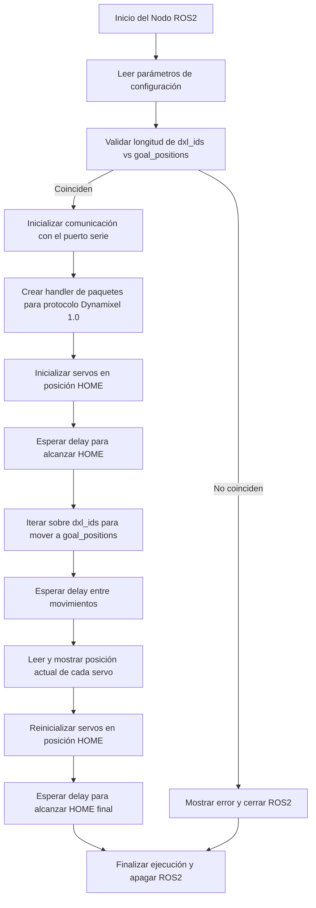

<picture>
    <source srcset="https://imgur.com/5bYAzsb.png" media="(prefers-color-scheme: dark)">
    <source srcset="https://imgur.com/Os03JoE.png" media="(prefers-color-scheme: light)">
    
</picture>

<h3>Curso de Robótica 2025-I</h3>

<h1>Laboratorio 04</h1>

<h2>Cinemática Directa- Phantom X- ROS</h2>

<h4>Juan José Díaz Guerrero 
    Cristian Fabián Martínez Bohórquez</h4>

 

## Diagrama de flujo de acciones del robot

## Descripción de Funciones

Este archivo implementa una Interfaz Humano-Máquina (HMI) con PyQt5 para controlar y visualizar el manipulador PhantomX Pincher X100 usando ROS 2 y servomotores Dynamixel.

### Funciones de Conversión

#### `degrees_to_position(deg: float) -> int`
Convierte un ángulo en grados al valor correspondiente del servo Dynamixel (rango 0–1023).
- **Entrada:** ángulo en grados (`-150°` a `+150°` típicamente).
- **Salida:** valor entero del registro de posición del servo.

#### `position_to_degrees(pos: int) -> float`
Convierte un valor de posición del servo Dynamixel al ángulo correspondiente en grados.
- **Entrada:** valor de posición (`int`) entre 0 y 1023.
- **Salida:** ángulo en grados.

---

### Clase `PincherNode(Node)`

Nodo de ROS 2 que:
- Inicializa parámetros (`port`, `baudrate`, `dxl_ids`).
- Configura la comunicación con los servomotores Dynamixel mediante `PortHandler` y `PacketHandler`.
- Activa el torque, establece la velocidad y el límite de torque para cada ID.

---

### Clase `HMIWindow(QWidget)`

Ventana principal de la interfaz gráfica, que permite:

#### `send_positions(self)`
- Lee los ángulos de las articulaciones desde campos de texto.
- Valida que estén dentro del rango `[-150°, 150°]`.
- Convierte los ángulos a posiciones y envía los comandos a cada servo.
- Llama a `plot_3d()` para visualizar el manipulador en su nueva configuración.

#### `update_positions(self)`
- Se ejecuta cada segundo mediante un `QTimer`.
- Lee las posiciones actuales de los servos desde los registros.
- Las muestra en la interfaz.
- Actualiza la visualización 3D con `plot_3d()`.

#### `plot_3d(self, pos_list: List[int])`
- Calcula la posición espacial del efector final a partir de los ángulos actuales.
- Utiliza `matplotlib` para graficar una vista 3D del manipulador (cinemática directa simplificada en 4 DOF).
- Los enlaces se modelan como líneas conectadas con puntos (`o`).

---

### `main(args=None)`
- Inicializa ROS 2.
- Crea el nodo `PincherNode`.
- Lanza la aplicación Qt (`QApplication`) y muestra la HMI.
- Al cerrar la ventana, cierra ROS 2.

---
## Simulación e Implementación

https://youtu.be/_YCTB0OJG8c
